# Walkie-Talkie Web App

Simple real-time push-to-talk voice chat using WebSockets and Node.js.

## 🐳 Run with Docker

```bash
docker-compose up
```

---

## 🚀 Features

- Press & hold to record voice
- Real-time voice streaming over WebSockets
- Minimal UI with speaker and mic feedback
- Dockerized and easy to run

---

## 🛠️ System Design Overview

```mermaid


flowchart LR

Client1[🎙️User] -->|audio/webm| Server[Node.JS + Websockets]
Server -->|audio/webm| A[🔊User 2]
Server -->|audio/webm| B[🔊User 3]
Server -->|audio/webm| C[⋮]
Server -->|audio/webm| D[🔊User N ]
```

